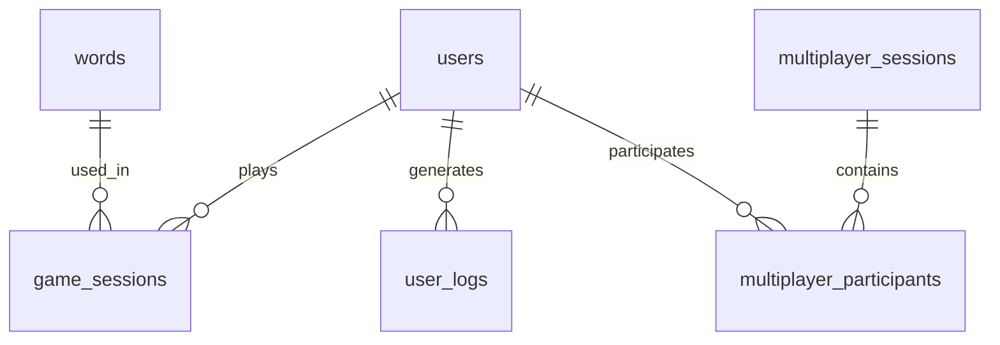

# 타자 게임 데이터베이스 설계 문서

## 목차
1. [DB 설계 프로세스](#db-설계-프로세스)
2. [DB 테이블 설계](#db-테이블-설계)
3. [ERD (Entity Relationship Diagram)](#erd)
4. [확장 가능성을 위한 설계](#확장-가능성을-위한-설계)

## DB 설계 프로세스

### 1. 요구사항 분석
- 프로젝트에서 다룰 주요 엔티티와 속성을 정의
- 주요 엔티티:
  * 사용자 정보 (유저 ID, 닉네임, 프로필 등)
  * 게임 데이터 (플레이 기록, 점수, 성공률 등)
  * 단어 데이터 (난이도, 카테고리, 단어 내용 등)
  * 멀티플레이 데이터 (룸 ID, 참가자 정보, 결과 등)

### 2. 데이터 모델링
- 엔티티와 속성을 정의하고, 엔티티 간의 관계를 설계
- 주요 관계:
  * 1:N 관계: 한 사용자는 여러 게임 세션을 가질 수 있음
  * M:N 관계: 한 세션에서 여러 유저가 플레이할 수 있음

### 3. 정규화
- 중복 데이터와 불필요한 데이터 의존성을 제거
- 3차 정규화까지 진행
- 성능 요구에 따라 일부 테이블은 비정규화(Join 최소화)

### 4. ERD 설계
- 테이블과 관계를 시각적으로 표현
- 사용 가능한 툴:
  * MySQL Workbench
  * ER/Studio
  * draw.io

### 5. 특정 요구사항 반영
- 확장성과 성능을 위한 고려사항:
  * 인덱스 설계
  * 분산 데이터베이스 구조

## DB 테이블 설계

### 1. 사용자 테이블 (users)
| 필드명 | 타입 | 설명 |
|--------|------|------|
| user_id | BIGINT | Primary Key, 유저 고유 ID |
| nickname | VARCHAR | 닉네임 |
| email | VARCHAR | 이메일 주소 |
| profile | VARCHAR | 프로필 이미지 URL |
| created_at | DATETIME | 가입일 |
| last_login | DATETIME | 마지막 접속일 |

### 2. 단어 데이터 테이블 (words)
| 필드명 | 타입 | 설명 |
|--------|------|------|
| word_id | BIGINT | Primary Key, 단어 고유 ID |
| content | VARCHAR | 단어 내용 |
| difficulty | INT | 난이도 (1~5) |
| category | VARCHAR | 카테고리 (일반, 테마 등) |
| created_at | DATETIME | 생성일 |

### 3. 게임 세션 테이블 (game_sessions)
| 필드명 | 타입 | 설명 |
|--------|------|------|
| session_id | BIGINT | Primary Key, 세션 고유 ID |
| user_id | BIGINT | Foreign Key, 플레이어 ID |
| score | INT | 최종 점수 |
| accuracy | FLOAT | 정확도 (%) |
| words_completed | INT | 성공한 단어 개수 |
| created_at | DATETIME | 세션 생성일 |

### 4. 멀티플레이 테이블
#### multiplayer_sessions
| 필드명 | 타입 | 설명 |
|--------|------|------|
| room_id | BIGINT | Primary Key, 방 ID |
| host_user_id | BIGINT | Foreign Key, 방장 유저 ID |
| status | VARCHAR | 방 상태 (대기, 진행 중, 종료) |
| created_at | DATETIME | 방 생성 시간 |

#### multiplayer_participants
| 필드명 | 타입 | 설명 |
|--------|------|------|
| room_id | BIGINT | Foreign Key, 방 ID |
| user_id | BIGINT | Foreign Key, 참가 유저 ID |
| score | INT | 개인 점수 |
| status | VARCHAR | 유저 상태 (준비, 진행 중) |

### 5. 유저 행동 로그 테이블 (user_logs)
| 필드명 | 타입 | 설명 |
|--------|------|------|
| log_id | BIGINT | Primary Key, 로그 ID |
| user_id | BIGINT | Foreign Key, 유저 ID |
| action | VARCHAR | 행동 타입 (로그인, 게임 시작 등) |
| created_at | DATETIME | 행동 발생 시각 |

## ERD

## 확장 가능성을 위한 설계

### 1. 확장 가능 데이터 구조
- **NoSQL 활용**
  * 멀티플레이 상태(실시간 게임 진행 정보)를 JSON 형식으로 MongoDB에 저장
  * 유연한 스키마로 게임 데이터 확장 용이

- **분산 처리**
  * Kafka: 실시간 이벤트 처리
  * Redis: 실시간 점수 업데이트 및 캐싱

- **데이터 웨어하우스**
  * BigQuery/Snowflake: 유저 행동 데이터 분석
  * 장기 데이터 보관 및 분석

### 2. 성능 최적화
- **인덱스 적용**
  * 자주 조회되는 데이터(유저 점수, 단어 목록)
  * 복합 인덱스 활용으로 쿼리 성능 향상

- **캐싱 전략**
  * Redis를 활용한 핫 데이터 캐싱
  * 캐시 갱신 전략 수립

- **데이터 분할**
  * 샤딩을 통한 데이터 분산 저장
  * 대규모 트래픽 대응
