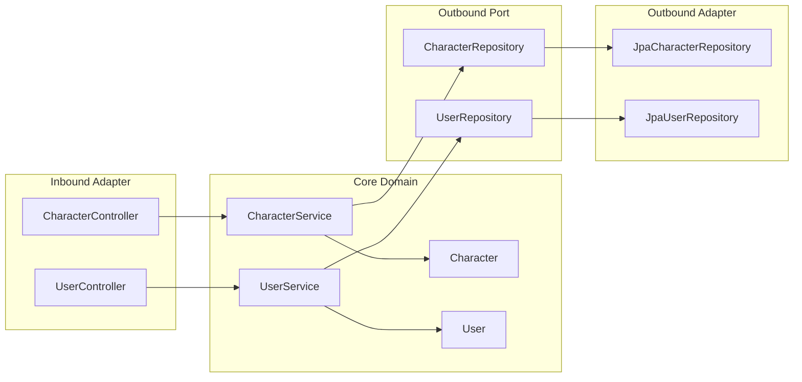

```mermaid
flowchart LR
  subgraph "Inbound Adapter"
    CharacterController
    UserController
  end

  subgraph "Core Domain"
    CharacterService
    UserService
    Character
    User
  end

  subgraph "Outbound Port"
    CharacterRepository
    UserRepository
  end

  subgraph "Outbound Adapter"
    JpaCharacterRepository
    JpaUserRepository
  end

  CharacterController --> CharacterService
  UserController --> UserService
  CharacterService --> Character
  UserService --> User
  CharacterService --> CharacterRepository
  UserService --> UserRepository
  CharacterRepository --> JpaCharacterRepository
  UserRepository --> JpaUserRepository
```
