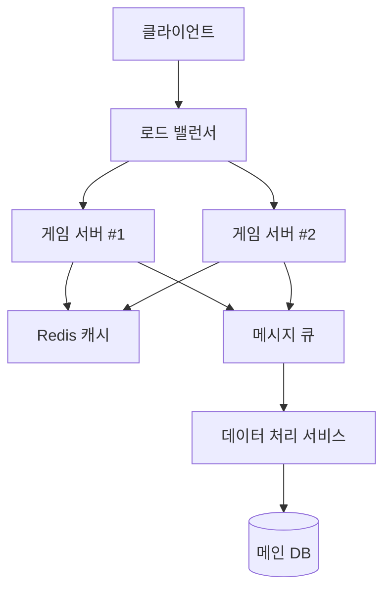

# 타자 게임 백엔드 기술 명세서

## 1. 데이터 처리 및 효율성

### API 설계 및 최적화
- **RESTful API 엔드포인트**
  ```
  GET  /api/v1/words          # 단어 리스트 조회
  GET  /api/v1/words/{level}  # 난이도별 단어 조회
  POST /api/v1/scores         # 게임 점수 등록
  GET  /api/v1/leaderboard    # 리더보드 조회
  ```
- **응답 속도 최적화**
  - API 응답 시간 목표: 100ms 이내
  - 페이지네이션 적용: `/api/v1/words?page=1&size=20`
  - 부분 응답 지원: `?fields=id,word,level`

### 캐싱 전략
- **Redis 캐시 계층**
  - 단어 데이터 캐싱: `TTL 1시간`
  - 리더보드 캐싱: `TTL 5분`
  - 사용자 세션 데이터: `TTL 24시간`

### 비동기 처리
- **메시지 큐 구현**
  ```
  게임 완료 → 점수 등록 큐 → 비동기 처리
  └─ 리더보드 업데이트
  └─ 통계 데이터 집계
  └─ 업적 달성 확인
  ```

## 2. 확장 가능한 아키텍처

### 클라우드 인프라 구성


### 마이크로서비스 구조
- **서비스 분리**
  - 단어 관리 서비스
  - 게임 로직 서비스
  - 사용자 관리 서비스
  - 리더보드 서비스
  - 통계 분석 서비스

### 컨테이너 구성
```yaml
# Docker Compose 예시
version: '3.8'
services:
  game-service:
    build: ./game-service
    scale: 3
  word-service:
    build: ./word-service
  user-service:
    build: ./user-service
  redis:
    image: redis:alpine
  rabbitmq:
    image: rabbitmq:management
```

## 3. 성능 및 트래픽 처리

### 부하 테스트 시나리오
- **JMeter 테스트 케이스**
  - 동시 접속자 1000명 처리
  - API 응답 시간 95% tile < 200ms
  - 초당 트랜잭션 처리량 > 500 TPS

### DB 최적화 전략
```sql
-- 인덱스 설계 예시
CREATE INDEX idx_word_level ON words(level);
CREATE INDEX idx_score_user ON scores(user_id, score);
CREATE INDEX idx_timestamp ON game_records(created_at);
```

### 실시간 처리 구현
```java
@Configuration
@EnableWebSocket
public class WebSocketConfig {
    @Bean
    public WebSocketHandler gameHandler() {
        return new GameWebSocketHandler();
    }
    
    @Bean
    public HandlerMapping handlerMapping() {
        Map<String, WebSocketHandler> map = new HashMap<>();
        map.put("/ws/game", gameHandler());
        return new SimpleUrlHandlerMapping(map, -1);
    }
}
```

## 4. 데이터 분석 및 리더보드

### 데이터 수집 스키마
```sql
CREATE TABLE game_analytics (
    id BIGSERIAL PRIMARY KEY,
    user_id BIGINT,
    word_count INT,
    accuracy DECIMAL(5,2),
    wpm INT,
    level INT,
    created_at TIMESTAMP DEFAULT CURRENT_TIMESTAMP
);
```

### 리더보드 구현
```java
@Service
public class LeaderboardService {
    private final RedisTemplate<String, String> redisTemplate;
    
    public void updateScore(String userId, double score) {
        redisTemplate.opsForZSet().add("leaderboard", userId, score);
    }
    
    public List<LeaderboardEntry> getTopScores(int limit) {
        return redisTemplate.opsForZSet()
            .reverseRangeWithScores("leaderboard", 0, limit - 1);
    }
}
```

## 5. 백엔드 보안 강화

### 인증 구현
```java
@Configuration
public class SecurityConfig extends WebSecurityConfigurerAdapter {
    @Override
    protected void configure(HttpSecurity http) throws Exception {
        http.oauth2ResourceServer()
            .jwt()
            .and()
            .authorizeRequests()
            .antMatchers("/api/v1/public/**").permitAll()
            .antMatchers("/api/v1/games/**").authenticated()
            .antMatchers("/api/v1/admin/**").hasRole("ADMIN");
    }
}
```

### 보안 필터 구현
```java
@Component
public class RateLimitFilter extends OncePerRequestFilter {
    private final RateLimiter rateLimiter;
    
    @Override
    protected void doFilterInternal(HttpServletRequest request,
            HttpServletResponse response,
            FilterChain filterChain) throws ServletException, IOException {
        if (!rateLimiter.tryAcquire()) {
            response.setStatus(HttpStatus.TOO_MANY_REQUESTS.value());
            return;
        }
        filterChain.doFilter(request, response);
    }
}
```

## 6. 모니터링 및 로깅

### Prometheus 메트릭 설정
```yaml
management:
  endpoints:
    web:
      exposure:
        include: prometheus,health,info
  metrics:
    tags:
      application: ${spring.application.name}
    export:
      prometheus:
        enabled: true
```

### 로그 구성
```yaml
logging:
  pattern:
    console: "%d{yyyy-MM-dd HH:mm:ss} [%thread] %-5level %logger{36} - %msg%n"
  level:
    root: INFO
    com.game: DEBUG
    org.springframework.web: INFO
```

## 7. 기술 스택 상세

### 백엔드 프레임워크
- Spring Boot 2.7.x
- Spring WebFlux (리액티브 프로그래밍)
- Spring Security
- Spring Data JPA/Redis

### 데이터베이스
- PostgreSQL 14
- Redis 6.2
- MongoDB 5.0

### DevOps
- Docker
- Kubernetes
- Jenkins Pipeline
- ELK Stack

### 모니터링
- Prometheus
- Grafana
- Spring Actuator

```
### 1. **데이터 처리 및 효율성**

- **API 설계 및 최적화**
  - 게임 내 데이터(단어 리스트, 점수 기록 등)를 처리하는 RESTful API를 설계.
  - API 호출 횟수와 응답 속도를 최적화하여 트래픽 증가를 처리할 수 있는 구조 설계.
  - 예: `GET /api/words`, `POST /api/score`.
- **캐싱**
  - Redis 같은 캐시 시스템을 사용해 자주 요청되는 데이터(단어 리스트 등)를 메모리에 저장.
  - DB 쿼리 부하를 줄이고 응답 속도를 향상.
- **비동기 작업 처리**
  - RabbitMQ, Kafka와 같은 메시지 큐를 활용해 점수 저장, 리더보드 업데이트 등을 비동기적으로 처리.
  - 사용자가 느끼는 지연을 최소화.

------

### 2. **확장 가능한 아키텍처**

- **클라우드 기반 인프라**
  - AWS, GCP, Azure와 같은 클라우드 서비스를 사용하여 동적으로 확장 가능한 서버를 구축.
  - 예: AWS Lambda로 서버리스 백엔드 구현.
- **마이크로서비스 아키텍처**
  - 단어 데이터 처리, 점수 관리, 유저 인증 등 기능을 각각의 마이크로서비스로 분리.
  - 서비스 간 통신은 gRPC 또는 REST API로 처리.
- **컨테이너화 및 오케스트레이션**
  - Docker로 애플리케이션 컨테이너화.
  - Kubernetes를 활용해 트래픽 증가 시 동적으로 스케일링 가능.

------

### 3. **성능 및 트래픽 처리**

- **부하 테스트**
  - Apache JMeter, Locust로 API 부하 테스트를 진행해 처리 속도와 병렬 요청 수용 능력을 평가.
  - 테스트 결과를 기반으로 병목 구간을 최적화.
- **DB 최적화**
  - 쿼리 성능 최적화를 위해 인덱스 설계.
  - 대량의 데이터 처리에는 파티셔닝 또는 샤딩 사용.
- **실시간 데이터 처리**
  - WebSocket이나 Socket.IO를 활용해 실시간으로 점수를 업데이트하거나 상태를 공유.
  - 대규모 사용자 접속 시 트래픽 분산을 위해 로드 밸런싱 적용.

------

### 4. **데이터 분석 및 리더보드**

- **데이터 수집 및 통계**
  - 게임 데이터를 수집하여 플레이어의 타자 속도, 정확도, 실패율 등 다양한 지표를 분석.
  - 이 데이터를 기반으로 사용자 맞춤형 난이도를 추천하거나 트렌드를 시각화.
- **리더보드 구현**
  - 사용자들의 점수를 랭킹별로 저장하고 정렬.
  - Redis Sorted Set을 활용하면 빠른 정렬이 가능.
- **추천 시스템**
  - 머신러닝 모델을 통해 플레이어의 실력을 분석하고 적절한 난이도를 추천.

------

### 5. **백엔드 보안 강화**

- **인증 및 권한 관리**
  - JWT 또는 OAuth 2.0을 사용해 사용자 인증 구현.
  - 리더보드나 게임 데이터는 사용자 권한에 따라 접근 제한.
- **보안 강화**
  - API 호출 시 Rate Limiting 적용.
  - SQL Injection 및 XSS 방지 필터링 추가.

------

### 6. **포트폴리오에 어필할 포인트**

- **확장 가능성**: 설계부터 대규모 사용자를 가정한 아키텍처 적용.
- **성능 최적화**: 실제 부하 테스트를 통해 확인한 성능 개선 결과 포함.
- **데이터 처리 기술**: 실시간 분석 및 추천 시스템으로 데이터 활용 능력 강조.
- **DevOps 적용**: CI/CD 파이프라인 구축 및 자동화 배포 경험 포함.
- **팀 협업 가능성**: 클라우드, 마이크로서비스 설계를 통한 협업 환경 구축.

------

### 추가적인 기술 스택

- **백엔드**: Spring Boot, Node.js, Django.
- **데이터베이스**: PostgreSQL, MongoDB, Redis.
- **DevOps**: Jenkins, GitLab CI/CD, Docker, Kubernetes.
- **모니터링**: Grafana, Prometheus를 통해 실시간 시스템 상태 점검.

```