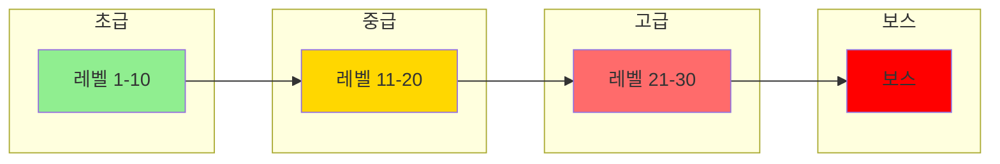
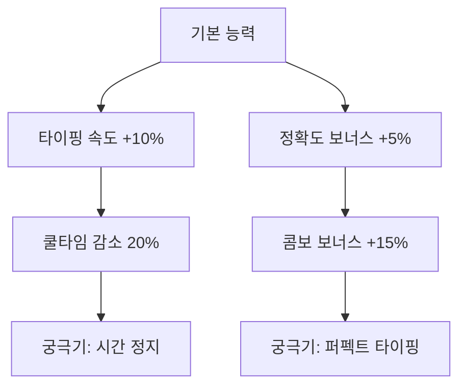
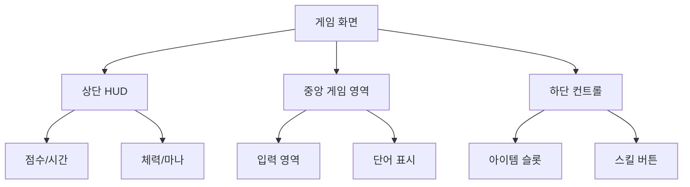

# 타자 게임 게임플레이 설계서

## 1. 레벨 디자인

### 난이도 진행 곡선


### 레벨별 특성
| 레벨 | 단어 길이 | 제한 시간 | 특수 효과 | 배경 테마 |
|------|-----------|------------|------------|------------|
| 1-10 | 2-4글자 | 여유로움 | 기본 이펙트 | 평화로운 숲 |
| 11-20 | 4-6글자 | 보통 | 단어 흔들림 | 도시 야경 |
| 21-30 | 6-8글자 | 타이트 | 페이드 효과 | 우주 정거장 |
| 보스 | 8글자 이상 | 극한 | 폭발 효과 | 화산 |

## 2. 로그라이크 시스템

### 스킬 트리 구조


### 진행 시스템
- **게임 오버 시 보존되는 요소**:
  - 획득한 스킬 포인트의 20%
  - 수집한 아이템의 10%
  - 달성한 업적

- **게임 오버 시 초기화되는 요소**:
  - 현재 스테이지 진행도
  - 임시 버프 효과
  - 현재 보유 아이템

## 3. 아이템 시스템

### 아이템 상세
| 종류 | 이름 | 효과 | 지속시간 | 획득 조건 |
|------|------|------|-----------|------------|
| 공격 | 워드 스크램블 | 상대방 단어 순서 변경 | 10초 | 10콤보 달성 |
| 공격 | 블라인드 | 상대방 화면 일부 가림 | 5초 | 15콤보 달성 |
| 방어 | 실드 | 방해 효과 무시 | 8초 | 아이템 상자 |
| 버프 | 스피드업 | 입력 속도 30% 증가 | 15초 | 퍼펙트 입력 |

### 아이템 획득 확률
```javascript
const itemDropRate = {
    common: 0.5,    // 기본 아이템
    rare: 0.3,      // 희귀 아이템
    epic: 0.15,     // 영웅 아이템
    legendary: 0.05 // 전설 아이템
};
```

## 4. 게임 모드 상세

### 클래식 모드
```javascript
const classicMode = {
    timeLimit: 180,  // 3분
    initialWords: 5, // 화면에 표시되는 초기 단어 수
    pointsPerWord: word => word.length * 10,
    comboMultiplier: combo => Math.floor(combo / 10) + 1
};
```

### 생존 모드
```javascript
const survivalMode = {
    initialHealth: 100,
    healthDecayRate: 1, // 초당 감소량
    wordDamage: 10,     // 실패 시 데미지
    healAmount: 5       // 성공 시 회복량
};
```

### 협동 모드
```javascript
const coopMode = {
    playerCount: 2,
    sharedHealth: 150,
    wordSplit: true,    // 단어 분할 가능
    reviveTime: 30      // 팀원 부활 시간
};
```

### 경쟁 모드
```javascript
const pvpMode = {
    rounds: 3,
    roundTime: 60,
    itemEnabled: true,
    matchmaking: {
        skillRange: 100,
        maxWaitTime: 30
    }
};
```

## 5. 이벤트 시스템

### 랜덤 이벤트 풀
| 이벤트명 | 발동 조건 | 효과 | 지속시간 |
|----------|------------|------|-----------|
| 골든 타임 | 15% 확률 | 모든 점수 2배 | 20초 |
| 폭탄 해체 | 10% 확률 | 긴 문장 입력 시 보너스 | 30초 |
| 타임 워프 | 5% 확률 | 시간 흐름 감소 | 10초 |
| 카오스 | 8% 확률 | 모든 효과 랜덤 적용 | 15초 |

### 이벤트 스케줄링
```javascript
const eventSchedule = {
    minInterval: 30,  // 최소 이벤트 간격
    maxEvents: 3,     // 동시 발생 가능한 최대 이벤트
    prioritySystem: {
        difficulty: 0.3,
        playerSkill: 0.4,
        gameTime: 0.3
    }
};
```

## 6. UI/UX 설계

### 화면 구성


### 애니메이션 효과
```javascript
const animations = {
    wordSpawn: {
        effect: 'fadeIn',
        duration: 0.3,
        easing: 'easeOutQuad'
    },
    wordDestroy: {
        effect: 'explode',
        duration: 0.5,
        particles: 20
    },
    combo: {
        threshold: 5,
        scale: 1.2,
        shake: true
    }
};
```

## 7. 성과 및 보상 시스템

### 업적 시스템
| 업적명 | 조건 | 보상 |
|--------|------|------|
| 초보 타자 | 첫 게임 완료 | 기본 스킨 |
| 콤보 마스터 | 50콤보 달성 | 스킬 포인트 |
| 생존 전문가 | 생존 10분 달성 | 특수 효과 |
| PvP 챔피언 | 10회 승리 | 칭호 |

### 일일 과제
```javascript
const dailyQuests = {
    tasks: [
        {
            name: '웜업',
            requirement: '3게임 진행',
            reward: 100
        },
        {
            name: '정확한 손가락',
            requirement: '95% 정확도 달성',
            reward: 200
        },
        {
            name: '속도의 달인',
            requirement: '분당 100단어 달성',
            reward: 300
        }
    ]
};
```

```
### 1. **레벨 디자인**

- **난이도 곡선 설계**:
  - 초기에는 단순한 단어를 입력하지만, 시간이 지날수록 단어 길이와 속도를 증가시켜 도전 과제를 제공합니다.
  - 보스 스테이지 추가: 특정 시간 동안 긴 문장이나 어려운 단어를 제한된 시간 안에 완성해야 하는 특별 스테이지.
- **단계별 테마 변화**:
  - 레벨에 따라 배경, 글자 색상, 이펙트 등이 변화.
  - 예: 초급은 평화로운 숲, 고급은 전투적인 화산 환경.

------

### 2. **로그라이크 요소**

- **무작위성**:
  - 매번 게임 시작 시 단어, 이벤트, 아이템이 무작위로 생성되어 새로운 경험 제공.
  - 단어 리스트가 동적이며 난이도에 따라 변경.
- **진행 및 성장 시스템**:
  - 사용자가 게임 중 점수를 통해 **스킬 트리**를 성장시킬 수 있도록 설계.
  - 예: 입력 속도를 증가시키거나 제한 시간을 연장하는 업그레이드.
- **리플레이 가치**:
  - 로그라이크 장르의 특성을 살려, 사용자마다 다른 게임 경험을 제공하여 재도전을 유도.

------

### 3. **아이템 시스템**

- **아이템 효과**:
  - **공격 아이템**: 상대의 화면에 방해 요소 추가(단어 가리기, 단어 섞기).
  - **방어 아이템**: 자신의 화면에서 어려운 단어 제거.
  - **버프 아이템**: 일정 시간 동안 입력 속도 증가나 점수 2배.
- **획득 방식**:
  - 단어 입력 성공 시 무작위 드랍 또는 특정 스테이지 클리어 보상.
  - 게임 내 상점에서 구매 가능.

------

### 4. **이벤트 충돌**

- **랜덤 이벤트**:
  - 특정 시간마다 보너스 점수나 추가 제한 시간이 주어지는 이벤트 발생.
  - 예: "폭탄 제거 이벤트"에서 특정 시간 내에 긴 단어를 입력해야만 점수를 얻음.
- **위험 요소**:
  - 잘못된 입력 시 화면이 방해받거나, 다음 단어의 난이도가 상승.
  - 일정 시간이 지나면 단어가 자동으로 사라지며 패널티 적용.

------

### 5. **게임 모드 구분**

#### **(1) 클래식 모드**

- 정해진 시간 안에 가능한 많은 단어를 입력하여 점수를 얻는 기본 모드.

#### **(2) 생존 모드**

- 단어를 빠르게 입력하지 못하면 체력이 감소하며, 생존 시간이 오래 지속될수록 보상이 커짐.

#### **(3) 협동 모드**

- 멀티플레이로 팀원과 함께 단어를 입력하며 점수를 합산.
- 서로의 실수를 보완하여 팀워크 강조.

#### **(4) 경쟁 모드**

- 1:1 실시간 대결로 단어 입력 속도와 정확도를 비교.
- 상대 화면에 방해 효과 추가(아이템 활용 가능).

------

### 6. **기술적 구현 방안**

- **UI/UX 디자인 툴**:
  - Figma, Adobe XD로 사용자 인터페이스 설계.
  - Unity를 사용해 동적 배경과 효과 추가.
- **게임 엔진 사용**:
  - **Unity** 또는 **Unreal Engine**을 활용하여 그래픽적 요소 강화.
  - **HTML, CSS, JavaScript** 기반으로도 경량 게임 구현 가능(단, 그래픽 연출 제한적).
- **실시간 멀티플레이**:
  - WebSocket이나 Socket.IO로 실시간 게임 데이터 전송.
  - AWS GameLift를 통해 대규모 멀티플레이어 세션 관리.
- **애니메이션 추가**:
  - 애니메이션 라이브러리(GSAP, Lottie)로 화면 이펙트를 강화.
  - 단어 입력 성공 시 폭발 효과, 점수 상승 애니메이션.

------

### 7. **포트폴리오 어필 포인트**

- **게임의 확장성**: 사용자 경험을 강화하는 다양한 모드와 시스템.

- 백엔드 강점

  :

  - 멀티플레이어 서버 설계.
  - 실시간 이벤트 처리와 아이템 시스템 구현.

- **기술 다양성**: 프론트엔드와 백엔드의 협업으로 게임 전체 설계 가능성 강조.

- **창의적 설계 능력**: 로그라이크, RPG 요소 추가를 통해 독창적 게임으로 발전.
```
