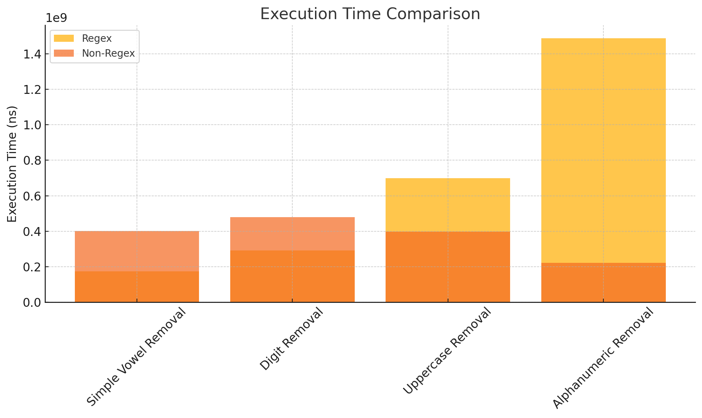
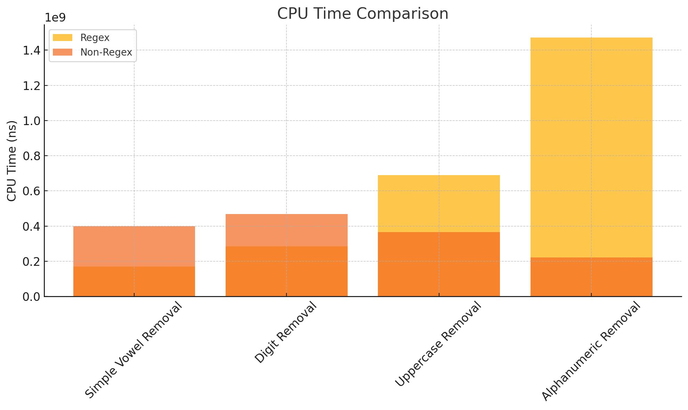
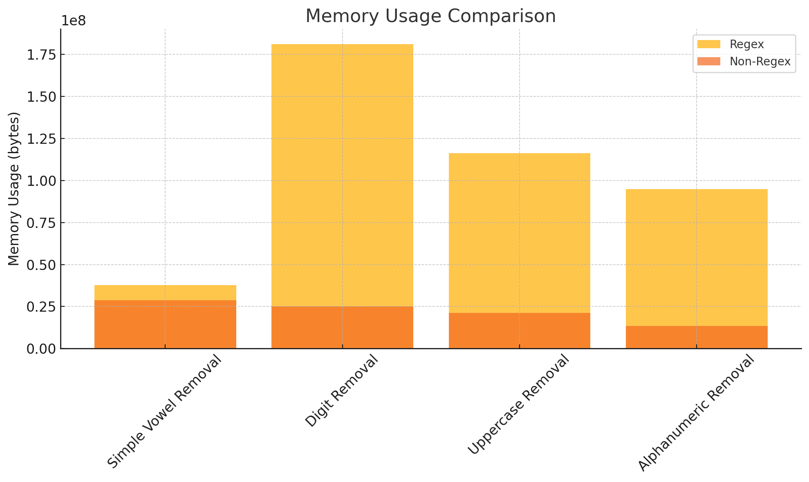

# 성능 분석: 정규식(Regex) vs 비정규식(Non-Regex) 접근 방식

## 소개
본 문서는 문자열 처리 작업에서 **정규식(Regex)**과 **비정규식(Non-Regex)** 접근 방식 간의 성능 차이를 비교 분석한 내용이다. 이를 통해 실행 시간, CPU 사용 시간, 메모리 사용량 등 다양한 지표를 기반으로 두 방식의 효율성을 평가한다. 
네 가지 테스트 케이스를 통해 성능을 분석하였으며, 테스트 케이스는 다음과 같다:

1. **간단한 모음 제거**
2. **숫자 제거**
3. **대문자 제거**
4. **알파벳 및 숫자 제거**

---

## 테스트 환경
- **운영체제**: Windows 10
- **Java 버전**: JDK 17
- **실행 환경**: IntelliJ IDEA Community Edition 2024.2.4
- **테스트 입력**: 약 1,000,000자의 문자열(`abcdefghijklmnopqrstuvwxyzABCDEFGHIJKLMNOPQRSTUVWXYZ0123456789` 반복 생성)

---

## 테스트 방법

### 주요 지표
1. **실행 시간**: 작업 시작부터 종료까지의 경과 시간, `System.nanoTime()`으로 측정.
2. **CPU 사용 시간**: CPU가 실제 작업에 소요한 시간, `ThreadMXBean.getCurrentThreadCpuTime()`으로 측정.
3. **메모리 사용량**: 작업 전후 JVM의 사용 가능한 메모리 차이로 계산, `Runtime.totalMemory()`와 `Runtime.freeMemory()` 사용.

### 코드 구성
각 테스트 케이스는 다음 두 가지 접근 방식을 사용하여 비교:

#### 정규식(Regex)
- Java의 `String.replaceAll()` 메서드를 사용하여 특정 패턴을 제거.

#### 비정규식(Non-Regex)
- `StringBuilder`와 조건문을 사용하여 직접적으로 특정 문자를 제거.

### 코드 예제
#### 정규식 접근 방식:
```java
String resultRegex = input.replaceAll("[aeiou]", "");
```

#### 비정규식 접근 방식:
```java
StringBuilder resultNonRegex = new StringBuilder();
for (char ch : input.toCharArray()) {
    if ("aeiou".indexOf(ch) == -1) {
        resultNonRegex.append(ch);
    }
}
```

---

## 전체 코드
```java
import java.lang.management.ManagementFactory;
import java.lang.management.ThreadMXBean;
import java.util.ArrayList;
import java.util.List;

public class RegexVsNonRegex {

    public static void main(String[] args) {
        // 긴 테스트 문자열 생성
        String input = "abcdefghijklmnopqrstuvwxyzABCDEFGHIJKLMNOPQRSTUVWXYZ0123456789".repeat(1_000_000);

        // 테스트 케이스 실행
        System.out.println("Test Case 1: Simple Vowel Removal");
        testPerformance(input, "[aeiou]", "aeiou");

        System.out.println("Test Case 2: Digit Removal");
        testPerformance(input, "\\d", "0123456789");

        System.out.println("Test Case 3: Uppercase Removal");
        testPerformance(input, "[A-Z]", "ABCDEFGHIJKLMNOPQRSTUVWXYZ");

        System.out.println("Test Case 4: Alphanumeric Removal");
        testPerformance(input, "[a-zA-Z0-9]", "abcdefghijklmnopqrstuvwxyzABCDEFGHIJKLMNOPQRSTUVWXYZ0123456789");
    }

    public static void testPerformance(String input, String regexPattern, String charSet) {
        ThreadMXBean threadMXBean = ManagementFactory.getThreadMXBean();
        Runtime runtime = Runtime.getRuntime();
        int iterations = 10; // 평균값 계산을 위한 반복 실행 수

        // 정규식을 사용한 방법 측정
        runtime.gc();
        List<Long> regexCpuTimes = new ArrayList<>();
        List<Long> regexExecutionTimes = new ArrayList<>();
        List<Long> regexMemoryUsages = new ArrayList<>();

        for (int i = 0; i < iterations; i++) {
            long memoryBeforeRegex = runtime.totalMemory() - runtime.freeMemory();
            long startCpuRegex = threadMXBean.getCurrentThreadCpuTime();
            long startTimeRegex = System.nanoTime();
            String resultRegex = input.replaceAll(regexPattern, "");
            long endTimeRegex = System.nanoTime();
            long endCpuRegex = threadMXBean.getCurrentThreadCpuTime();
            long memoryAfterRegex = runtime.totalMemory() - runtime.freeMemory();

            regexCpuTimes.add(endCpuRegex - startCpuRegex);
            regexExecutionTimes.add(endTimeRegex - startTimeRegex);
            regexMemoryUsages.add(Math.abs(memoryAfterRegex - memoryBeforeRegex));

            // 각 반복의 결과 출력
            System.out.println("Regex Iteration " + (i + 1) + ":");
            System.out.println("  CPU Time: " + (endCpuRegex - startCpuRegex) + " ns");
            System.out.println("  Execution Time: " + (endTimeRegex - startTimeRegex) + " ns");
            System.out.println("  Memory Usage: " + Math.abs(memoryAfterRegex - memoryBeforeRegex) + " bytes");
        }

        double averageRegexCpuTime = regexCpuTimes.stream().mapToLong(Long::longValue).average().orElse(0);
        double averageRegexExecutionTime = regexExecutionTimes.stream().mapToLong(Long::longValue).average().orElse(0);
        double averageRegexMemory = regexMemoryUsages.stream().mapToLong(Long::longValue).average().orElse(0);

        System.out.println("Average Regex CPU Time: " + averageRegexCpuTime + " ns");
        System.out.println("Average Regex Execution Time: " + averageRegexExecutionTime + " ns");
        System.out.println("Average Regex Memory Usage: " + averageRegexMemory + " bytes");

        // 정규식을 사용하지 않은 방법 측정
        runtime.gc();
        List<Long> nonRegexCpuTimes = new ArrayList<>();
        List<Long> nonRegexExecutionTimes = new ArrayList<>();
        List<Long> nonRegexMemoryUsages = new ArrayList<>();

        for (int i = 0; i < iterations; i++) {
            long memoryBeforeNonRegex = runtime.totalMemory() - runtime.freeMemory();
            long startCpuNonRegex = threadMXBean.getCurrentThreadCpuTime();
            long startTimeNonRegex = System.nanoTime();
            StringBuilder resultNonRegex = new StringBuilder();
            for (char ch : input.toCharArray()) {
                if (charSet.indexOf(ch) == -1) {
                    resultNonRegex.append(ch);
                }
            }
            long endTimeNonRegex = System.nanoTime();
            long endCpuNonRegex = threadMXBean.getCurrentThreadCpuTime();
            long memoryAfterNonRegex = runtime.totalMemory() - runtime.freeMemory();

            nonRegexCpuTimes.add(endCpuNonRegex - startCpuNonRegex);
            nonRegexExecutionTimes.add(endTimeNonRegex - startTimeNonRegex);
            nonRegexMemoryUsages.add(Math.abs(memoryAfterNonRegex - memoryBeforeNonRegex));

            // 각 반복의 결과 출력
            System.out.println("Non-Regex Iteration " + (i + 1) + ":");
            System.out.println("  CPU Time: " + (endCpuNonRegex - startCpuNonRegex) + " ns");
            System.out.println("  Execution Time: " + (endTimeNonRegex - startTimeNonRegex) + " ns");
            System.out.println("  Memory Usage: " + Math.abs(memoryAfterNonRegex - memoryBeforeNonRegex) + " bytes");
        }

        double averageNonRegexCpuTime = nonRegexCpuTimes.stream().mapToLong(Long::longValue).average().orElse(0);
        double averageNonRegexExecutionTime = nonRegexExecutionTimes.stream().mapToLong(Long::longValue).average().orElse(0);
        double averageNonRegexMemory = nonRegexMemoryUsages.stream().mapToLong(Long::longValue).average().orElse(0);

        System.out.println("Average Non-Regex CPU Time: " + averageNonRegexCpuTime + " ns");
        System.out.println("Average Non-Regex Execution Time: " + averageNonRegexExecutionTime + " ns");
        System.out.println("Average Non-Regex Memory Usage: " + averageNonRegexMemory + " bytes");

        System.out.println();
    }
}
```

### 코드 설명
1. **`testPerformance` 메서드**:
   - 입력 문자열과 패턴 또는 문자 집합을 기반으로 정규식과 비정규식 접근 방식을 각각 테스트.
   - 각 반복에서 CPU 시간, 실행 시간, 메모리 사용량을 측정하고 출력.
2. **정규식(Regex) 측정**:
   - `replaceAll` 메서드를 사용해 특정 패턴의 문자열을 제거.
3. **비정규식(Non-Regex) 측정**:
   - `StringBuilder`와 조건문을 사용해 특정 문자를 제거.
4. **결과 출력**:
   - 각 반복 결과와 평균값을 출력.

---

## 테스트 결과

### 1. 테스트 케이스: 간단한 모음 제거
| 지표               | 정규식(Regex)        | 비정규식(Non-Regex) |
|-------------------|--------------------|--------------------|
| **평균 실행 시간** | 174,878,110 ns     | 401,848,020 ns     |
| **평균 CPU 시간**  | 170,312,500 ns     | 400,000,000 ns     |
| **평균 메모리 사용량** | 37,802,886 bytes   | 28,687,173 bytes   |

#### 관찰:
- 정규식이 실행 및 CPU 시간 면에서 비정규식보다 약 두 배 이상 빠름.
- 비정규식은 메모리 사용량이 더 적음.

### 2. 테스트 케이스: 숫자 제거
| 지표               | 정규식(Regex)        | 비정규식(Non-Regex) |
|-------------------|--------------------|--------------------|
| **평균 실행 시간** | 291,936,930 ns     | 479,253,420 ns     |
| **평균 CPU 시간**  | 284,375,000 ns     | 468,750,000 ns     |
| **평균 메모리 사용량** | 181,194,092 bytes  | 25,164,646 bytes   |

#### 관찰:
- 정규식은 CPU와 실행 시간이 비정규식보다 40%가량 더 효율적.
- 비정규식은 메모리 사용량이 훨씬 적음.

### 3. 테스트 케이스: 대문자 제거
| 지표               | 정규식(Regex)        | 비정규식(Non-Regex) |
|-------------------|--------------------|--------------------|
| **평균 실행 시간** | 698,618,920 ns     | 398,425,450 ns     |
| **평균 CPU 시간**  | 689,062,500 ns     | 365,625,000 ns     |
| **평균 메모리 사용량** | 116,183,131 bytes  | 21,177,490 bytes   |

#### 관찰:
- 비정규식이 실행 및 CPU 시간 면에서 정규식보다 약 40% 더 효율적.
- 정규식은 메모리 사용량이 더 큼.

### 4. 테스트 케이스: 알파벳 및 숫자 제거
| 지표               | 정규식(Regex)        | 비정규식(Non-Regex) |
|-------------------|--------------------|--------------------|
| **평균 실행 시간** | 1,487,029,970 ns   | 222,972,350 ns     |
| **평균 CPU 시간**  | 1,471,875,000 ns   | 221,875,000 ns     |
| **평균 메모리 사용량** | 94,903,512 bytes   | 13,421,566 bytes   |

#### 관찰:
- 비정규식이 실행 및 CPU 시간이 정규식보다 **6배 이상 빠름**.
- 비정규식의 메모리 사용량은 정규식보다 약 7배 적음.

---

### 시각적 비교

#### 실행 시간 비교
```plaintext
정규식과 비정규식의 실행 시간 차이를 시각적으로 비교하여 확인.
```


#### CPU 시간 비교
```plaintext
정규식과 비정규식의 CPU 사용 시간 차이를 시각적으로 비교하여 확인.
```


#### 메모리 사용량 비교
```plaintext
정규식과 비정규식의 메모리 사용량 차이를 시각적으로 비교하여 확인.
```


---

## 종합 분석

### 1. **정규식의 장점**
- 복잡한 패턴의 문자열 처리에서 간결한 코드와 높은 생산성을 제공.
- 간단한 문자 제거 작업에서는 상대적으로 성능이 우수.

### 2. **비정규식의 장점**
- 복잡한 작업에서 성능이 뛰어나며, 특히 실행 시간과 CPU 사용량 면에서 더 효율적.
- 메모리 사용량이 전반적으로 적음.

### 3. **단점**
- 정규식은 복잡한 작업에서 성능 저하가 두드러질 수 있음.
- 비정규식은 복잡한 패턴 처리 시 코드가 장황해지고 유지보수가 어려울 수 있음.

---

## 결론
- **간단한 패턴 처리**에는 정규식이 적합하며, **성능이 중요한 대규모 데이터 처리 작업**에서는 비정규식이 더 효율적.
- 두 방식은 **사용 목적과 요구사항에 따라 적절히 선택**해야 함.

---

## 향후 작업
- 대규모 데이터셋 및 극단적인 입력값(예: 빈 문자열) 처리 성능 테스트.
- 정규식의 성능을 향상시킬 수 있는 JVM 옵션과 병렬 처리 기법 탐구.
- 다른 프로그래밍 언어에서의 정규식과 비정규식 성능 비교.


